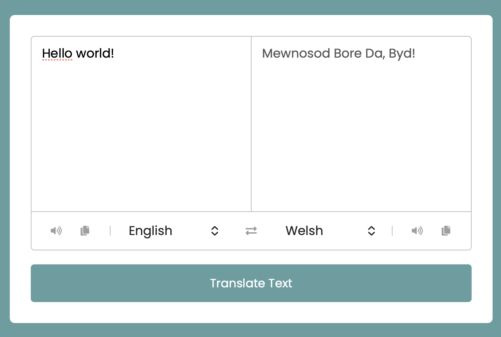

# Language Translator

## Overview

A web-based language translation application built with HTML, CSS, and JavaScript. The application allows users to translate text between multiple languages, listen to pronunciations using speech synthesis, and copy translations directly to their clipboard.

## Features

- Translate text between multiple languages
- Supports a wide range of languages
- Swap source and target languages instantly
- Text-to-speech pronunciation for both input and translated text
- Copy text to clipboard
- Clean and responsive user interface
- Real-time translation using the MyMemory Translation API

## Technologies

- HTML5
- CSS3
- JavaScript (ES6)
- MyMemory Translation API
- Web Speech API
- Font Awesome

## Project Structure

```text
Translator-App/
│
├── index.html
├── translator.png
├── README.md
│
└── src/
    ├── countries.js
    ├── index.js
    └── style.css
```

## Installation and Setup

### Clone the Repository

```bash
git clone https://github.com/Salmah1/Translator-App.git
cd Translator-App
```

### Run the Application

Open `index.html` in your web browser.

## How to Use

1. Enter text into the source text area.
2. Select the source language.
3. Select the target language.
4. Click **Translate Text**.
5. View the translated result.
6. Use the speaker icons to hear pronunciations.
7. Use the copy icons to copy text to your clipboard.
8. Click the exchange icon to swap languages and text.

## API

This project uses the MyMemory Translation API:

https://mymemory.translated.net/

## Screenshot


